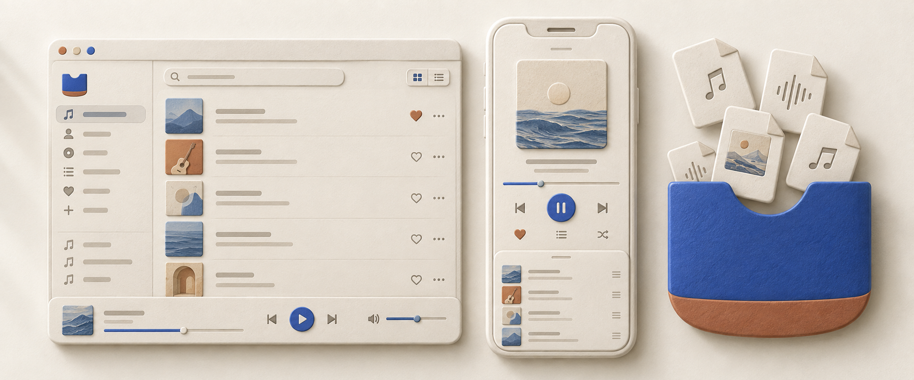

<p align="center">
  
</p>

# Music Pocket

> 把自己的音乐，放进口袋。<br>
> 本地优先 · 离线播放 · 音频不上传

> [!WARNING]
> 项目仍在开发中，尚未发布正式安装包。当前优先保证 iOS 与 macOS 体验。

Music Pocket 是一款 Flutter 跨平台本地音乐播放器。用户导入自己的音频文件后，应用会在设备上管理副本、解析元数据与封面，并提供资料库、艺术家、歌单、搜索、播放队列和后台播放；项目没有服务端，也不提供在线串流。

## 已实现

- 导入文件或递归扫描文件夹：MP3、FLAC、WAV、OGG、M4A、AAC、WMA、Opus
- 读取并编辑标题、艺术家、专辑、流派、年份与封面
- 按歌曲、艺术家、歌单组织资料库，支持本地搜索
- 播放队列、顺序/单曲循环/随机播放、后台与锁屏控制
- SHA-256 内容去重，避免同一音频换路径后被重复导入
- 存储占用统计与未引用托管文件清理
- Pocket Atelier 响应式界面：iOS 底部导航、macOS 侧边栏、深浅主题

导入时会把音频复制到应用管理目录；用户最初选择的源文件不会被删除。删除歌曲时也只允许清理应用自己的托管副本和无引用封面。

## 技术栈

| 范围 | 实现 |
| --- | --- |
| 客户端 | Flutter / Dart |
| 状态管理 | Riverpod + code generation |
| 本地数据库 | Drift + SQLite |
| 音频 | just_audio + audio_service + audio_session |
| 元数据 | audio_metadata_reader |
| 模型 | Freezed + json_serializable |

## 平台状态

| 平台 | 当前状态 |
| --- | --- |
| iOS | iOS 15+；已在 iPhone 真机完成 Personal Team 签名、安装与运行 |
| macOS | 已完成 Debug 构建和实际窗口验证 |
| Android | 平台工程已存在；当前开发机未配置 Android SDK，Release 尚未验证 |
| Windows | 平台工程及 media_kit 音频后端已接入；完整 Release 尚未验证，构建插件时需开启 Windows Developer Mode |

## 更新后重新部署

### iPhone

普通 Dart/UI 更新可以继续打开 `ios/Runner.xcworkspace`，选择 `Runner`、自己的 iPhone 和 `Release`，然后按 **Command + R**。这是 Xcode 快捷键，不是终端命令。保持相同的 Team 与 Bundle ID 时，新版本会覆盖旧版本，应用数据通常会保留；不要先从手机删除应用。

如果依赖或生成代码发生变化，先在项目根目录执行：

```bash
# 获取或更新 Flutter 依赖
flutter pub get

# 仅在 Freezed、Riverpod 或 Drift 源定义变化后重新生成代码
dart run build_runner build --delete-conflicting-outputs

# 仅在 iOS 原生插件依赖变化后刷新 CocoaPods
cd ios && pod install && cd ..
```

免费 Personal Team 的开发签名通常只有 7 天有效期；到期后重新连接 iPhone，在 Xcode 中再次按 **Command + R** 即可续签安装。详见 [Flutter iOS 部署文档](https://docs.flutter.dev/deployment/ios)。

### 其他平台

```bash
# 在 macOS 上运行
flutter run -d macos

# 构建 macOS Release
flutter build macos --release

# 在已连接的 Android 设备上运行，先用 flutter devices 查看设备 ID
flutter run -d <device-id>

# 构建可侧载的 Android APK
flutter build apk --release

# 构建用于 Google Play 的 Android App Bundle
flutter build appbundle --release

# 在 Windows 上运行
flutter run -d windows

# 构建 Windows Release
flutter build windows --release
```

平台签名与打包细节见 Flutter 官方文档：[Android](https://docs.flutter.dev/deployment/android)、[macOS](https://docs.flutter.dev/deployment/macos)、[Windows](https://docs.flutter.dev/platform-integration/windows/building)。

## 哪些情况需要付费

| 目标 | 是否必须付费 |
| --- | --- |
| iPhone 自用真机调试 | 否。免费 Apple Account + Personal Team 即可，但开发签名约 7 天到期 |
| TestFlight / App Store 发布 | 是。需加入 Apple Developer Program，官方价格为每年 99 美元或当地等值价格 |
| macOS 本机自用构建 | 否 |
| macOS App Store，或使用 Developer ID 公证后可信地站外分发 | 是。使用同一个 Apple Developer Program 会员资格 |
| Android APK 自行安装或分发 | 否 |
| Google Play 发布 | 是。Play Console 注册费为一次性 25 美元 |
| Windows 本地运行或直接分发 | 否 |
| Microsoft Store 发布 | 微软当前的新账号注册流程不收注册费，但需要完成身份验证 |

费用与资格可能调整，请以上架时的官方页面为准：[Apple 会员比较](https://developer.apple.com/support/compare-memberships/)、[Google Play 开发者账号](https://support.google.com/googleplay/android-developer/answer/6112435)、[Microsoft Store 开发者账号 FAQ](https://learn.microsoft.com/en-us/windows/apps/publish/faq/open-developer-account)。

## 本地开发

```bash
# 获取依赖
flutter pub get

# 静态分析
flutter analyze

# 运行测试
flutter test
```

详细开发记录见 [DONE.md](DONE.md)。
